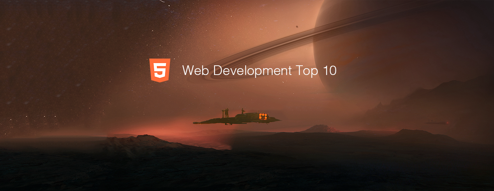

# Web Development Top 10 Articles for the Past Month (v.Feb 2018)

</a>

For the past month, we ranked nearly 1,500 Web Development articles to pick the Top 10 stories that can help advance your career (0.7% chance).
 
* Topics in this list:  Job Interview, Careers, Sketching, AI, Modern CSS, CTO, HTTPS, Service Workers, IBM Watson
* Also published on the [publication](https://goo.gl/L4UAHB)

 

#### Course of the month:

[A) Beginners: The Web Developer Bootcamp.](http://bit.ly/2EewLTH) [63,555 recommends, 4.7/5 stars]

[B) Fullstack: Node with React: Fullstack Web Development.](http://bit.ly/2EQfnEN) [3,929 recommends, 4.7/5 stars]

 

## Rank 1
### [Front-end-interview-handbook: Almost complete answers to "Front-end Job Interview Questions" which you can use to interview potential candidates, test yourself or completely ignore](https://github.com/yangshun/front-end-interview-handbook?utm_source=mybridge&utm_medium=blog&utm_campaign=read_more)

 

## Rank 2
### [Who Killed The Junior Developer?](https://medium.com/@melissamcewen/who-killed-the-junior-developer-33e9da2dc58c?utm_source=mybridge&utm_medium=blog&utm_campaign=read_more)

 

## Rank 3
### [Sketching in the Browser](https://medium.com/seek-blog/sketching-in-the-browser-33a7b7aa0526?utm_source=mybridge&utm_medium=blog&utm_campaign=read_more)

 

## Rank 4
### [How you can train an AI to convert your design mockups into HTML and CSS](https://medium.freecodecamp.org/how-you-can-train-an-ai-to-convert-your-design-mockups-into-html-and-css-cc7afd82fed4?utm_source=mybridge&utm_medium=blog&utm_campaign=read_more)

 

## Rank 5
### [How I applied lessons learned from a failed technical interview to get 5 job offers](https://medium.freecodecamp.org/how-i-applied-lessons-learned-from-a-failed-technical-interview-to-get-5-job-offers-656fcf58034d?utm_source=mybridge&utm_medium=blog&utm_campaign=read_more)

 

## Rank 6
### [Modern CSS Explained For Dinosaurs](https://medium.com/actualize-network/modern-css-explained-for-dinosaurs-5226febe3525?utm_source=mybridge&utm_medium=blog&utm_campaign=read_more)

 

## Rank 7
### [What I wish I knew when I became CTO](https://medium.com/sketchdeck-developer-blog/what-i-wish-i-knew-when-i-became-cto-fdc934b790e3?utm_source=mybridge&utm_medium=blog&utm_campaign=read_more)

 

## Rank 8
### [How to get your site on HTTPS for free in 10 minutes](https://medium.freecodecamp.org/free-https-c051ca570324?utm_source=mybridge&utm_medium=blog&utm_campaign=read_more)

 

## Rank 9
### [Service workers: the little heroes behind Progressive Web Apps](https://flaviocopes.com/service-workers?utm_source=mybridge&utm_medium=blog&utm_campaign=read_more)

 

## Rank 10
### [Voice recognition on the web using IBM Watson](https://www.youtube.com/watch?v=Imb4RSG6alg?utm_source=mybridge&utm_medium=blog&utm_campaign=read_more)
